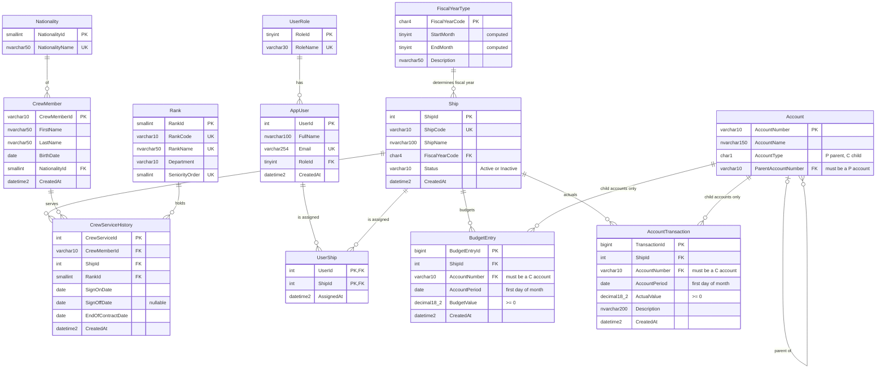

# Entity Relationship Diagram

```mermaid
erDiagram
  FiscalYearType ||--o{ Ship : "determines fiscal year"
  Ship ||--o{ CrewServiceHistory : "has"
  CrewMember ||--o{ CrewServiceHistory : "serves"
  Rank ||--o{ CrewServiceHistory : "holds"
  Nationality ||--o{ CrewMember : "of"
  UserRole ||--o{ AppUser : "has"
  AppUser ||--o{ UserShip : "is assigned"
  Ship ||--o{ UserShip : "is assigned"
  Account |o--o{ Account : "parent of"
  Ship ||--o{ BudgetEntry : "budgets"
  Account ||--o{ BudgetEntry : "child accounts only"
  Ship ||--o{ AccountTransaction : "actuals"
  Account ||--o{ AccountTransaction : "child accounts only"

  FiscalYearType {
    char4 FiscalYearCode PK
    tinyint StartMonth "computed"
    tinyint EndMonth "computed"
    nvarchar50 Description
  }
  Ship {
    int ShipId PK
    varchar10 ShipCode UK
    nvarchar100 ShipName
    char4 FiscalYearCode FK
    varchar10 Status "Active or Inactive"
    datetime2 CreatedAt
  }
  CrewMember {
    varchar10 CrewMemberId PK
    nvarchar50 FirstName
    nvarchar50 LastName
    date BirthDate
    smallint NationalityId FK
    datetime2 CreatedAt
  }
  Nationality {
    smallint NationalityId PK
    nvarchar50 NationalityName UK
  }
  Rank {
    smallint RankId PK
    varchar10 RankCode UK
    nvarchar50 RankName UK
    varchar10 Department
    smallint SeniorityOrder UK
  }
  CrewServiceHistory {
    int CrewServiceId PK
    varchar10 CrewMemberId FK
    int ShipId FK
    smallint RankId FK
    date SignOnDate
    date SignOffDate "nullable"
    date EndOfContractDate
    datetime2 CreatedAt
  }
  UserRole {
    tinyint RoleId PK
    varchar30 RoleName UK
  }
  AppUser {
    int UserId PK
    nvarchar100 FullName
    varchar254 Email UK
    tinyint RoleId FK
    datetime2 CreatedAt
  }
  UserShip {
    int UserId PK, FK
    int ShipId PK, FK
    datetime2 AssignedAt
  }
  Account {
    varchar10 AccountNumber PK
    nvarchar150 AccountName
    char1 AccountType "P parent, C child"
    varchar10 ParentAccountNumber FK "must be a P account"
  }
  BudgetEntry {
    bigint BudgetEntryId PK
    int ShipId FK
    varchar10 AccountNumber FK "must be a C account"
    date AccountPeriod "first day of month"
    decimal18_2 BudgetValue ">= 0"
    datetime2 CreatedAt
  }
  AccountTransaction {
    bigint TransactionId PK
    int ShipId FK
    varchar10 AccountNumber FK "must be a C account"
    date AccountPeriod "first day of month"
    decimal18_2 ActualValue ">= 0"
    nvarchar200 Description
    datetime2 CreatedAt
  }
```
